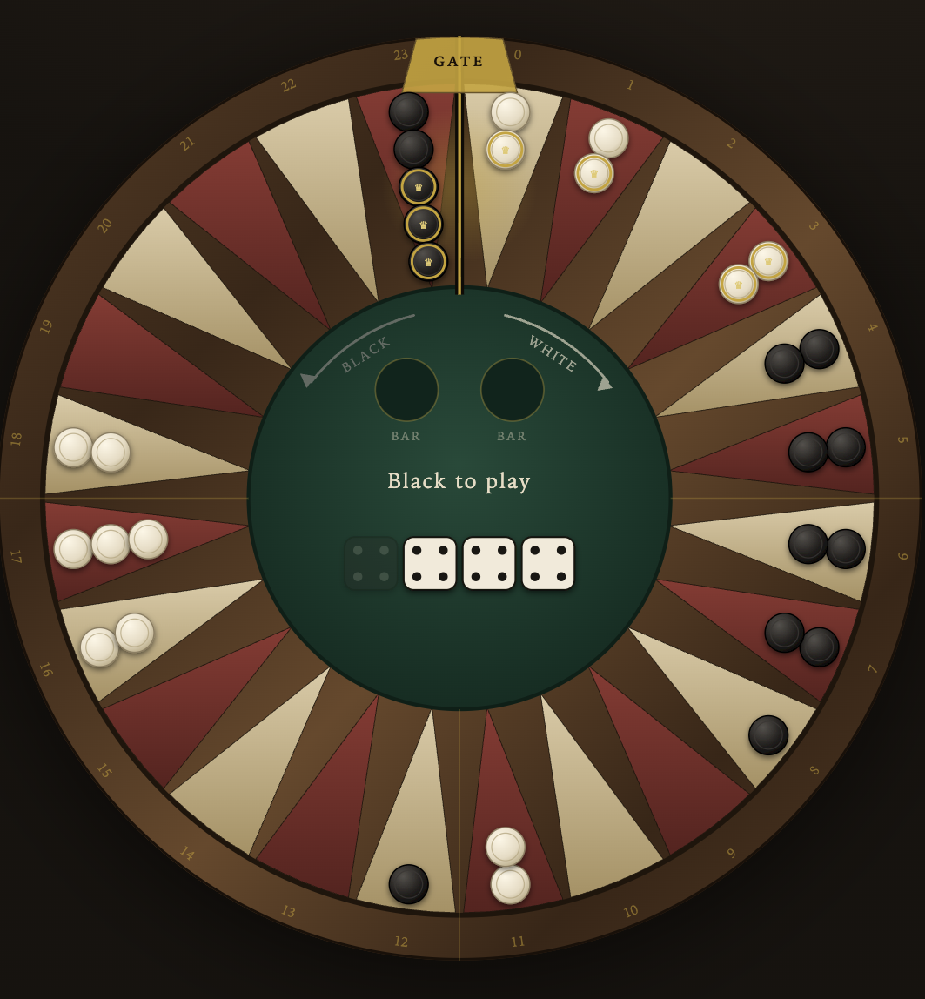

# Cycle Backgammon

Backgammon on a ring. The board's two ends are joined, so nothing is ever borne
off — checkers keep going round, and the linear game's two bear-off ends become
a **single gate** that both players cross in opposite directions.

Cross the gate and your checker is **crowned**. It does not leave the board: it
re-enters the ring just past the gate, deep in the other player's territory,
where it can no longer be hit and holds its point alone. Crowned checkers stop
racing and start **supporting** the ones still running. Crown all fifteen to win.

**[▶ Play](https://thoregraepel.github.io/cycle-backgammon/)**



*Mid-game. The crowned checkers either side of the gate are the point of the
whole thing: White crosses 23 → 0 and lands on 1 and 2, in Black's final
approach; Black crosses 0 → 23 and lands on 22 and 23, in White's. Every
checker you finish becomes an obstacle in the other player's way.*

## The board

Twenty-four points around a ring, in four quadrants of six. White travels
clockwise, Black anticlockwise. The gate sits between point 23 and point 0, at
the top of the ring, with the two home quadrants meeting on either side of it —
which is exactly what happens to a backgammon board when you bend it round and
weld the ends together.

The opening position is the standard backgammon position wrapped onto the ring
(White's 24/13/8/6 points become 0/11/16/18, Black's are the mirror image), so
each side starts on **exactly 167 pips** — the same race length as the real game.

## Rules

Standard backgammon, with the ends joined:

- **Movement.** Roll two dice, move two checkers or one checker twice. Doubles
  give four moves. You must play as many dice as you legally can, and if only
  one is playable, the larger.
- **Points.** You may not land on a point holding two or more enemy checkers,
  or on one holding a crowned enemy checker.
- **Hitting.** Land on a lone *uncrowned* enemy checker and it goes to the bar.
  It re-enters just past the gate and owes a full lap of 24 pips again — the bar
  is the 25 point, as always. Checkers on the bar come in before anything else
  moves.
- **Crowning.** A checker that crosses the gate is crowned and lands on the
  other side of it. There is no "bring everything home first" condition: a
  checker crowns the moment it gets there.
- **Crowned checkers** keep moving and keep blocking, but cannot be hit and
  cannot be crowned twice. They are supporters, not racers.
- **Winning.** First player with all fifteen checkers crowned.

## Why these rules

The topology forces the interesting decisions, but a few rulings were open.
These were settled by running the selfplay harness on each variant rather than
by taste — `test/selfplay.js` reports game length, hit rate and the seat split.

**What happens to a checker that laps?** Removing it is just backgammon with
extra steps, and it empties the board exactly when the game should be tensest.
Keeping it on the ring is what makes the game its own thing: your finished
checkers pile up in the opponent's home quadrant, where they are in the way.

**Can crowned checkers be hit?** This was the decision that made the game.
With crowned checkers hittable, selfplay ran **142 plies and 47 hits** per game:
the forced-dice rule drags your retired veterans through enemy territory forever,
everything is a blot, and the race stops mattering. Making them safe gives
**97 plies and 13 hits**, with game length variance roughly halved. It also
delivers the supporter role literally — a crowned checker holds a point on its
own, sheltering the runners behind it.

**Should crowned checkers be frozen in place?** Tempting, and it sharpens the
supporter idea further, but an immobile checker that gets hit can never come
back, and a board of them deadlocks. Mobile-but-safe keeps the position alive.

**Alternatives still on the table.** A *gate lock*, where no checker may cross
until all fifteen are in the final quadrant, restoring backgammon's bear-in
phase. *Losing the crown when hit*, for a sharper comeback mechanic at the cost
of much longer games. *Laps as score*, where a second lap is worth a second
point and the game is played to a target rather than to all-fifteen.

## The AI

`js/ai.js` searches every legal way to play the roll and scores the result on
the race, crowns banked, blots weighted by both the chance of being hit and the
pips a hit would cost, points made, priming, and checkers on the bar.

| Level | Search | Strength |
|---|---|---|
| `easy` | best of a few sampled plays | loses to `normal` 0–24 |
| `normal` | one ply over all legal plays | baseline |
| `strong` | expectimax over the opponent's 21 rolls, top 6 candidates | beats `normal` 13–1 |

`strong` takes about 90 ms per move.

## Running it

Static — no build step, no dependencies.

```sh
python3 -m http.server 8000    # then open http://localhost:8000
```

## Tests

```sh
node test/rules.js                 # rule checks: the gate, pips, hitting, forced plays
node test/selfplay.js 200 normal   # 200 AI games: termination, invariants, seat balance
```

`test/rules.js` covers the properties the ring changes — that both players cross
the same seam in opposite directions, that pips stay consistent under wraparound,
that a hit costs exactly one lap, and that the click-to-move UI can never offer a
step that strands a die. `test/selfplay.js` audits every position of every game
for checker conservation and legality, and checks that the strength ladder holds
from both seats.

## Licence

MIT
